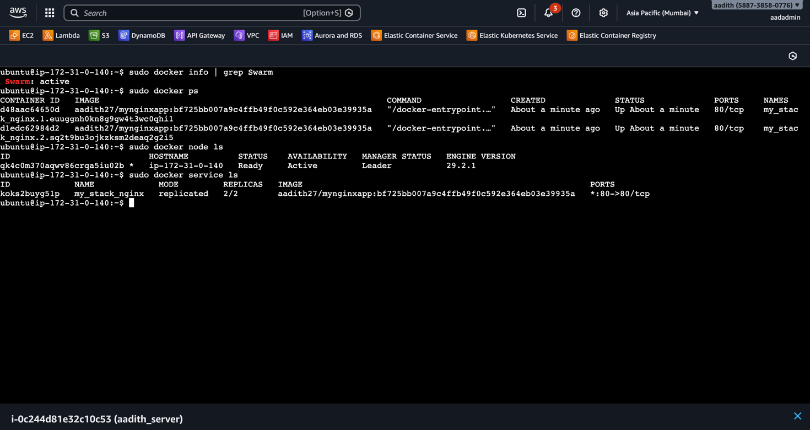
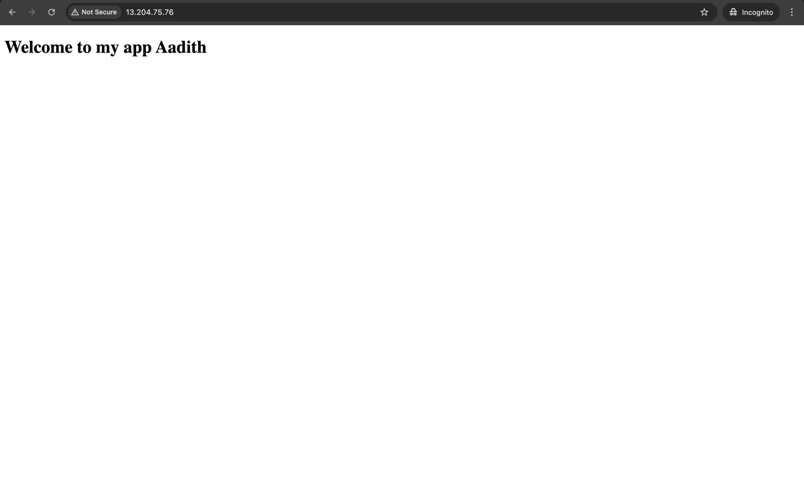

# MyNginxApp 🚀

A simple Docker-based Nginx application with CI/CD deployment.

## Overview

This project demonstrates a containerized Nginx web application using Docker and Docker Compose. The app is designed to run with multiple replicas in a Docker Swarm environment.

## Tech Stack

- **Docker** - Containerization
- **Nginx (Alpine)** - Web server
- **Docker Compose** - Orchestration
- **Docker Swarm** - Container deployment

## Quick Start

### Prerequisites

- Docker & Docker Compose installed
- Docker Swarm initialized (for production deployment)

### Run Locally

```bash
docker-compose up -d
```

Visit `http://localhost` in your browser.

### Stop

```bash
docker-compose down
```

### Deploy to Docker Swarm

```bash
# Initialize Docker Swarm (if not already initialized)
docker swarm init

# Deploy the stack
docker stack deploy -c docker-compose.yml aadith_swarm
```

### Remove Swarm Stack

```bash
docker stack rm aadith_swarm
```

## Project Structure

```
├── Dockerfile          # Nginx container configuration
├── docker-compose.yml  # Multi-replica setup
├── html/              # Static HTML files
│   └── index.html
└── screenshots/       # Proof of deployment
```

## Features

- ✅ Containerized Nginx server
- ✅ Multi-replica deployment (2 replicas)
- ✅ Docker Swarm ready
- ✅ Alpine Linux for lightweight images

## Screenshots

### Docker Swarm Running


### Nginx App


## Build & Push

```bash
docker build -t aadith27/mynginxapp:latest .
docker push aadith27/mynginxapp:latest
```
