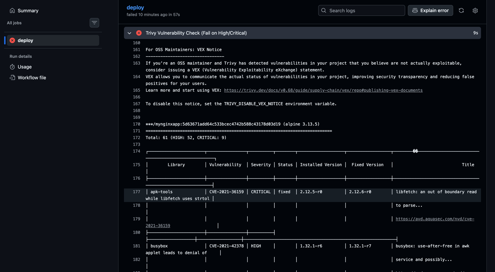
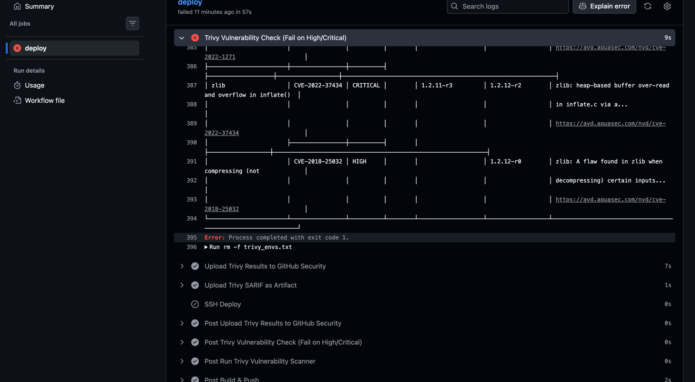
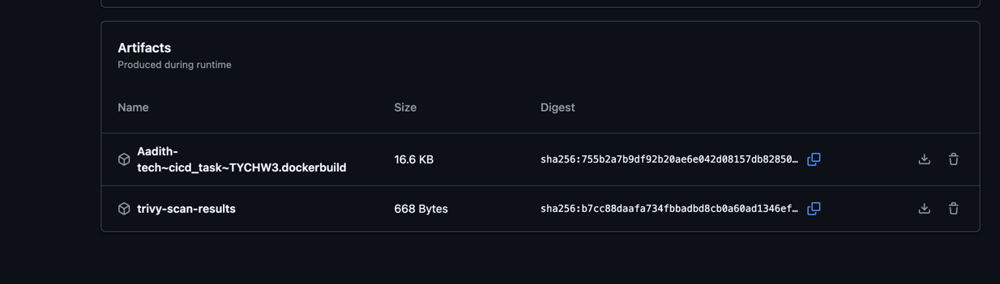

# MyNginxApp 

A containerized Nginx application with automated CI/CD pipeline, security scanning, and Docker Swarm deployment to AWS EC2.

## Overview

This project demonstrates a complete DevOps workflow with:
- Automated Docker image building and pushing to Docker Hub
- Trivy security vulnerability scanning
- GitHub Actions CI/CD pipeline
- Docker Swarm deployment to EC2

## Tech Stack

- **Nginx (Alpine)** - Lightweight web server
- **Docker** - Containerization
- **Docker Compose** - Service orchestration
- **Docker Swarm** - Production deployment
- **GitHub Actions** - CI/CD automation
- **Trivy** - Container security scanning
- **AWS EC2** - Cloud hosting

## Project Structure

```
├── Dockerfile              # Nginx Alpine with test vulnerabilities
├── docker-compose.yml      # Multi-replica Docker Swarm config
├── html/
│   └── index.html         # Web application content
├── .github/
│   └── workflows/
│       └── deploy.yml     # CI/CD with security checks
└── screenshots/           # Evidence & proof
```

## Quick Start

### Run Locally

```bash
docker-compose up -d
```

Visit `http://localhost` in your browser.

### Stop

```bash
docker-compose down
```

##  CI/CD Pipeline

The GitHub Actions workflow (`.github/workflows/deploy.yml`) runs on every push to `main`:

1. **Checkout** - Pull latest code
2. **Docker Hub Login** - Authenticate to registry
3. **Build & Push** - Build image, push with git SHA tag
4. **Trivy Scan (SARIF)** - Generate security report in SARIF format
5. **Trivy Check (Fail Gate)** - ⛔ **Fails pipeline if HIGH/CRITICAL CVEs found**
6. **Upload Results** - Report to GitHub Security tab
7. **Upload Artifact** - Store SARIF file in artifacts
8. **EC2 Deployment** - Deploy via Docker Swarm (only if all checks pass)

### Security Gate
- Pipeline **FAILS** if Trivy detects HIGH or CRITICAL vulnerabilities
- Deployment is **BLOCKED** until vulnerabilities are fixed
- Reports are still generated for analysis

## Docker Swarm Deployment

### Manual Deployment to Swarm

```bash
# Initialize swarm (one-time)
docker swarm init

# Deploy the stack
docker stack deploy -c docker-compose.yml aadith_swarm

# View services
docker stack services aadith_swarm

# Check running containers
docker stack ps aadith_swarm

# Remove stack
docker stack rm aadith_swarm
```

### Stack Configuration
- **Replicas**: 2 (load balancing)
- **Port**: 80 (HTTP)
- **Image**: `aadith27/mynginxapp:latest`

## Security Scanning

Trivy automatically scans every Docker image for CVEs (Common Vulnerabilities and Exposures).

### Vulnerability Detection
- **Scope**: OS packages and libraries
- **Severity Levels**: LOW, MEDIUM, HIGH, CRITICAL
- **Action on HIGH/CRITICAL**: Pipeline fails, deployment blocked
- **Unfixed vulns**: Ignored (with patches available only)

### View Trivy Results

**GitHub Actions Artifacts:**
- Go to **Actions** → workflow run → **Artifacts**
- Download `trivy-scan-results` (SARIF file)

**GitHub Security Tab:**
- Go to **Security** → **Code scanning alerts**
- View vulnerability details by severity

**Pipeline Failure Example:**
- If Dockerfile contains vulnerable packages (e.g., outdated curl, openssl)
- Trivy detects them with CVE details
- Workflow shows ❌ at "Trivy Vulnerability Check" step
- Deployment is skipped

##  Screenshots & Proof

### Application Running


### Docker Swarm Deployment


### Vulnerabilities Detected


### Pipeline Failure (Security Gate)


### GitHub Security Scanning Results


##  Required GitHub Secrets

Configure these in **Settings > Secrets and variables > Actions**:

```
DOCKERHUB_USERNAME    - Docker Hub username
DOCKERHUB_TOKEN       - Docker Hub access token
EC2_HOST              - EC2 instance IP address
EC2_USER              - EC2 SSH username (e.g., ec2-user)
EC2_SSH_KEY           - EC2 SSH private key
```

## Workflow Details

### Image Tagging Strategy
- **Latest tag**: `aadith27/mynginxapp:latest` - Points to most recent
- **Commit SHA tag**: `aadith27/mynginxapp:<git-sha>` - Immutable version

### Docker Swarm Deployment Process
1. Auto-initializes Docker Swarm (if not already)
2. Clones/updates repo on EC2
3. Dynamically updates image tag in `docker-compose.yml` to match current commit
4. Deploys stack with name `aadith_swarm`
5. Runs 2 replicas for load balancing on port 80

### Security Testing
The Dockerfile includes vulnerable package versions for testing:
- `openssl=1.1.1q-r0` - Multiple CVEs
- `curl=7.85.0-r0` - HTTP vulnerabilities
- `wget=1.21.2-r0` - Directory traversal CVEs
- `openssh=8.9p1-r0` - Authentication issues

These are intentional for CI/CD demonstration purposes.


