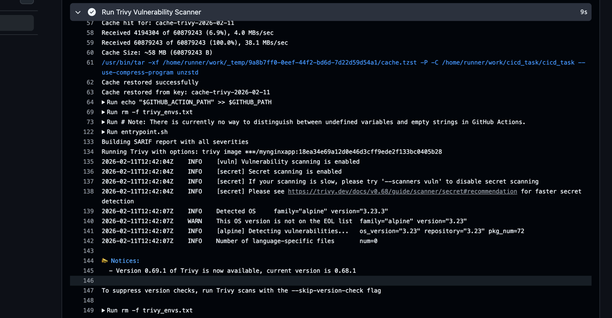

# MyNginxApp 

A containerized Nginx application with automated CI/CD pipeline, security scanning, and Docker Swarm deployment to AWS EC2.

## Overview

This project demonstrates a complete DevOps workflow with:
- Automated Docker image building and pushing to Docker Hub
- Trivy security vulnerability scanning
- GitHub Actions CI/CD pipeline
- Docker Swarm deployment to EC2

## Tech Stack

- **Nginx (Alpine)** - Lightweight web server
- **Docker** - Containerization
- **Docker Compose** - Service orchestration
- **Docker Swarm** - Production deployment
- **GitHub Actions** - CI/CD automation
- **Trivy** - Container security scanning
- **AWS EC2** - Cloud hosting

## Project Structure

```
├── Dockerfile              # Nginx Alpine container config
├── docker-compose.yml      # Multi-replica Swarm setup
├── html/
│   └── index.html         # Web app content
├── .github/
│   └── workflows/
│       └── deploy.yml     # CI/CD pipeline
└── screenshots/           # Deployment proof
    ├── docker_swarm_running.png
    ├── nginx_app.png
    ├── trivy_run_log.png
    └── code_scan_artifact.png
```

## Quick Start

### Run Locally

```bash
docker-compose up -d
```

Visit `http://localhost` in your browser.

### Stop

```bash
docker-compose down
```

##  CI/CD Pipeline

The GitHub Actions workflow runs on every push to `main`:

1. **Checkout** - Pull latest code
2. **Docker Hub Login** - Authenticate to registry
3. **Build & Push** - Build image and push with git SHA tag
4. **Trivy Scan** - Security vulnerability scanning
5. **Upload Results** - Report findings to GitHub Security
6. **EC2 Deployment** - Deploy via Docker Swarm using SSH

### Key Features
- ✅ Automatic image tagging with commit SHA
- ✅ Multi-platform builds (linux/amd64)
- ✅ Security scanning before deployment
- ✅ Vulnerability reports in GitHub Security tab
- ✅ Auto Docker installation on EC2 if needed
- ✅ Swarm auto-initialization

## Docker Swarm Deployment

### Manual Deployment to Swarm

```bash
# Initialize swarm (one-time)
docker swarm init

# Deploy the stack
docker stack deploy -c docker-compose.yml aadith_swarm

# View services
docker stack services aadith_swarm

# Check running containers
docker stack ps aadith_swarm

# Remove stack
docker stack rm aadith_swarm
```

### Stack Configuration
- **Replicas**: 2 (load balancing)
- **Port**: 80 (HTTP)
- **Image**: `aadith27/mynginxapp:latest`

## Security Scanning

Every push triggers Trivy scanning to detect CVEs (Common Vulnerabilities and Exposures).

### View Trivy Results

**In GitHub:**
1. Go to **Security** tab
2. Click **Code scanning alerts**
3. View vulnerability details with severity levels

**In Workflow Run:**
1. Go to **Actions** tab
2. Click the workflow run
3. Check **Artifacts** for `trivy-scan-results`
4. Expand **"Upload Trivy Results to GitHub Security"** step

##  Screenshots

### Nginx App Running


### Docker Swarm Status


### Trivy Scan Log


### GitHub Code Scanning


##  Required GitHub Secrets

Configure these in **Settings > Secrets and variables > Actions**:

```
DOCKERHUB_USERNAME    - Docker Hub username
DOCKERHUB_TOKEN       - Docker Hub access token
EC2_HOST              - EC2 instance IP address
EC2_USER              - EC2 SSH username (e.g., ec2-user)
EC2_SSH_KEY           - EC2 SSH private key
```

## Workflow Details

### Image Tagging
- Latest push tag: `aadith27/mynginxapp:latest`
- Commit-specific: `aadith27/mynginxapp:<git-sha>`

### Swarm Deployment
- Automatically updates image tag in docker-compose.yml
- Deploys with stack name: `aadith_swarm`
- Creates 2 replicas for load balancing


